<div align="center">

# ⚒️ CodeForge AI

### **Understand. Build. Test. Debug. Ship.**

**An autonomous AI software engineering platform that works with real software repositories.**

CodeForge AI combines repository intelligence, AI-powered planning, code generation, testing, debugging, verification, Git workflows, and security controls into one engineering loop.

<br>

<a href="<LIVE_DEMO_URL>">
  
</a>
&nbsp;
<a href="<GITHUB_REPOSITORY_URL>">
  
</a>

<br><br>


<br>

**AI Engineering Loop**

`Understand → Plan → Implement → Test → Observe → Reason → Fix → Verify → Ship`

</div>

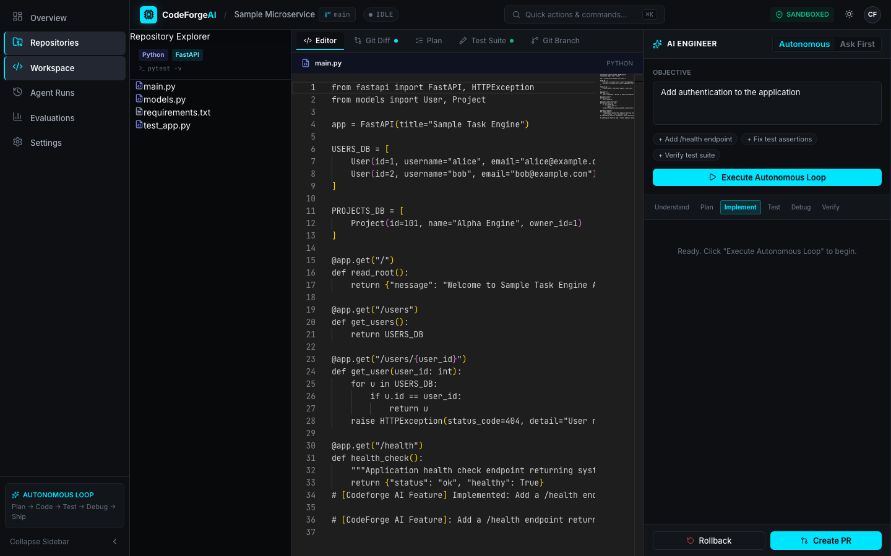

---

# 📌 Table of Contents

* [Overview](#-overview)
* [The Problem](#-the-problem)
* [The Solution](#-the-solution)
* [Why CodeForge AI](#-why-codeforge-ai)
* [Screenshots](#-screenshots)
* [Core Features](#-core-features)
* [AI Engineering Loop](#-ai-engineering-loop)
* [Multi-Agent Architecture](#-multi-agent-architecture)
* [Repository Intelligence](#-repository-intelligence)
* [AI Code Generation](#-ai-code-generation)
* [Autonomous Debugging](#-autonomous-debugging)
* [Testing & Verification](#-testing--verification)
* [Human Approval & Autonomy](#-human-approval--autonomy)
* [Security](#-security)
* [Git & GitHub Integration](#-git--github-integration)
* [AI Evaluation Engine](#-ai-evaluation-engine)
* [System Architecture](#-system-architecture)
* [Technology Stack](#-technology-stack)
* [Project Structure](#-project-structure)
* [API Overview](#-api-overview)
* [Database](#-database)
* [Getting Started](#-getting-started)
* [Environment Variables](#-environment-variables)
* [Running the Project](#-running-the-project)
* [Testing](#-testing)
* [Demo Workflow](#-demo-workflow)
* [Limitations](#-limitations)
* [Roadmap](#-roadmap)
* [Contributing](#-contributing)
* [License](#-license)
* [Author](#-author)

---

# 🧠 Overview

CodeForge AI is an **AI software engineering platform** designed to operate on real repositories instead of only generating isolated code snippets.

A developer can give CodeForge AI a software-engineering task such as:

> **"Add a `/health` endpoint returning the application status and a healthy boolean flag."**

Instead of simply answering with code, CodeForge AI can work through an engineering pipeline:

```text
User Request
     │
     ▼
Repository Understanding
     │
     ▼
Context Retrieval
     │
     ▼
Implementation Plan
     │
     ▼
Approval Gate
     │
     ▼
Code Generation
     │
     ▼
Patch Validation
     │
     ▼
Test Execution
     │
     ▼
Failure Analysis
     │
     ▼
Automated Repair
     │
     ▼
Re-Test
     │
     ▼
Code Review
     │
     ▼
Verification
     │
     ▼
Git Commit / Pull Request
```

The goal is to move AI-assisted development from:

**"Generate some code."**

to:

**"Understand the repository, make the change, test it, debug it, verify it, and prepare it for shipping."**

---

# 🎯 The Problem

Traditional AI coding assistants are often optimized around individual prompts:

```text
Developer
   ↓
Prompt
   ↓
AI
   ↓
Code Suggestion
```

Real software engineering is more complicated.

A real task may require:

* understanding an unfamiliar repository
* finding related files
* understanding dependencies
* creating an implementation plan
* modifying multiple files
* preserving existing behavior
* running tests
* interpreting failures
* fixing regressions
* reviewing the resulting diff
* checking security implications
* committing the changes
* preparing a pull request

CodeForge AI is designed around this complete workflow.

---

# 🚀 The Solution

CodeForge AI turns an engineering request into an **observable agent workflow**.

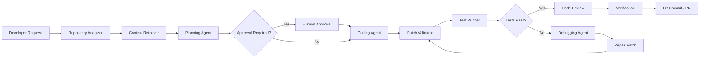

---

# ⭐ Why CodeForge AI?

CodeForge AI focuses on the complete **AI Engineering Loop**.

| Capability                | CodeForge AI |
| ------------------------- | ------------ |
| Repository understanding  | ✅            |
| Cross-file context        | ✅            |
| Structured planning       | ✅            |
| AI code generation        | ✅            |
| Patch validation          | ✅            |
| Automated testing         | ✅            |
| Failure analysis          | ✅            |
| Debugging loop            | ✅            |
| Code review               | ✅            |
| Human approval gates      | ✅            |
| Secret protection         | ✅            |
| Prompt-injection defense  | ✅            |
| Git branching             | ✅            |
| Commit generation         | ✅            |
| Pull-request generation   | ✅            |
| Agent execution telemetry | ✅            |
| AI evaluation benchmarks  | ✅            |

The system is designed around **engineering execution**, not just conversational code generation.

---

## 📸 Product Screenshots

### AI Engineering Workspace

The main CodeForge AI workspace combines repository intelligence, a code editor, and the AI software engineer into one development environment.


### Repository Intelligence

CodeForge AI analyzes the repository structure, dependencies, symbols, and relevant code before making changes.

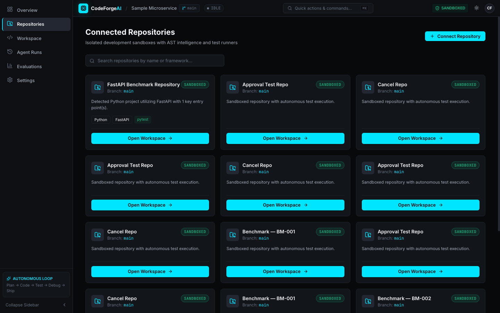

### AI Implementation Planning

The planning agent converts a natural-language engineering task into a structured implementation plan with affected files and execution steps.

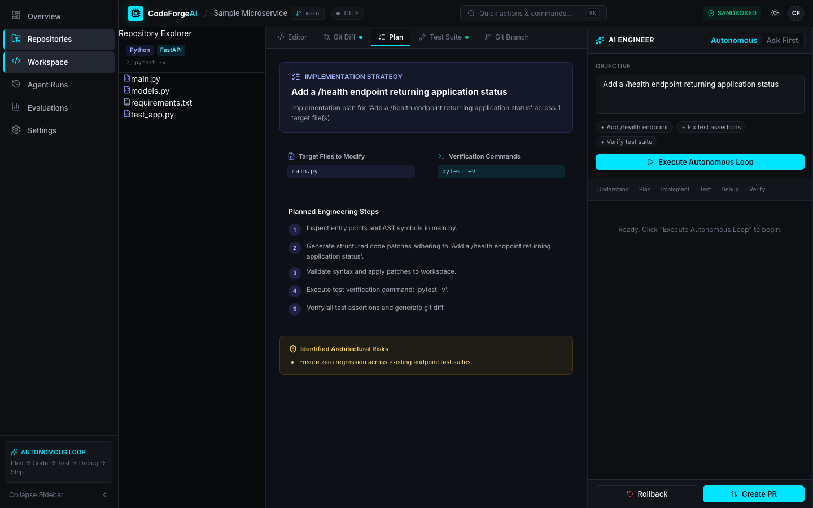

### Autonomous Agent Workflow

The AI engineering loop moves through repository understanding, planning, implementation, testing, debugging, and verification.

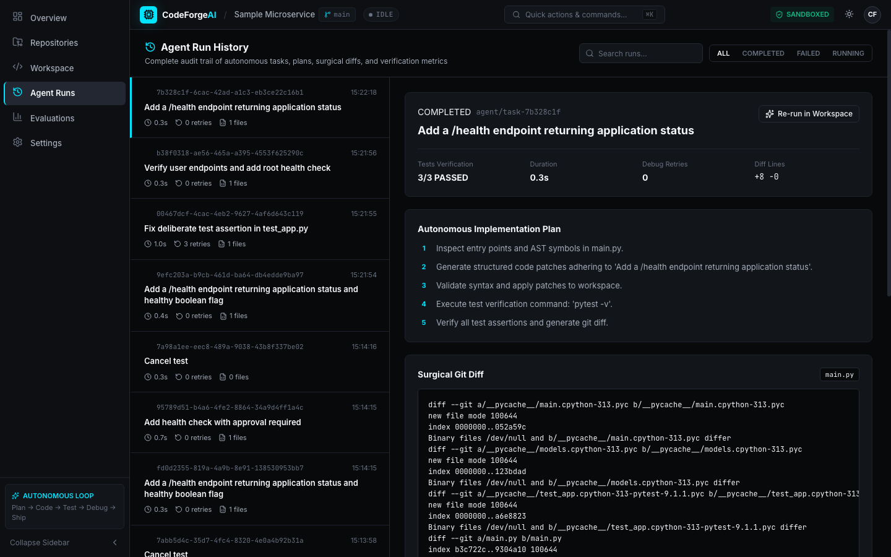

### Real Code Changes

Generated changes are presented as a Git-style diff before they are committed or pushed.

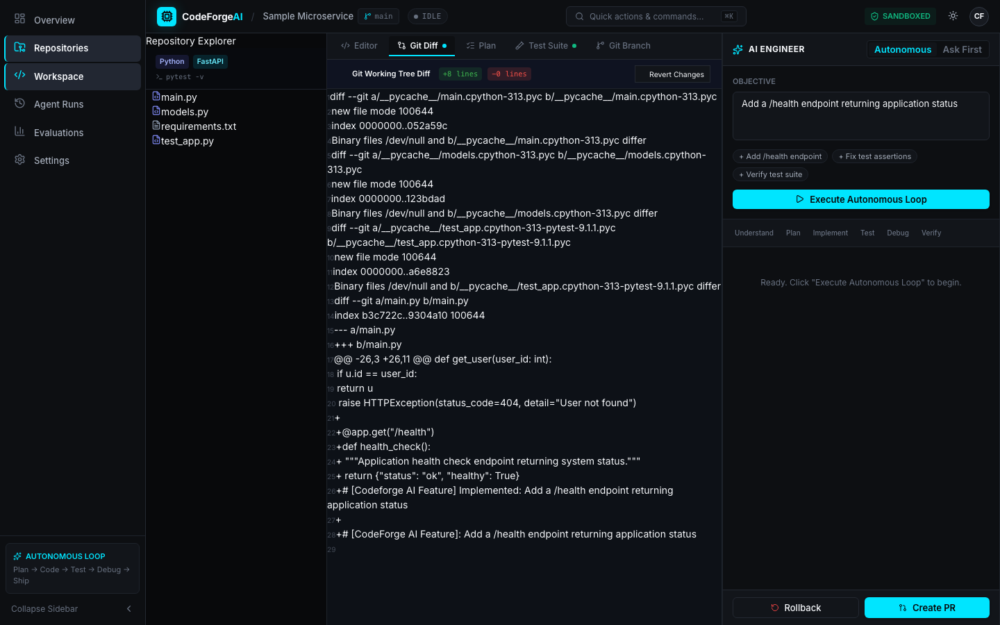

### Testing & Autonomous Debugging

CodeForge AI executes tests, analyzes failures, applies fixes, and verifies the resulting changes.

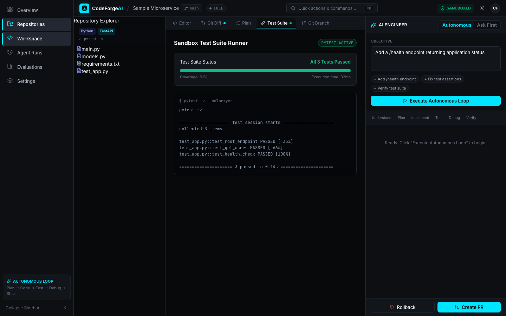

### Human Approval & Git Workflow

Sensitive operations can require explicit approval while Git branches, commits, and pull requests remain visible and auditable.

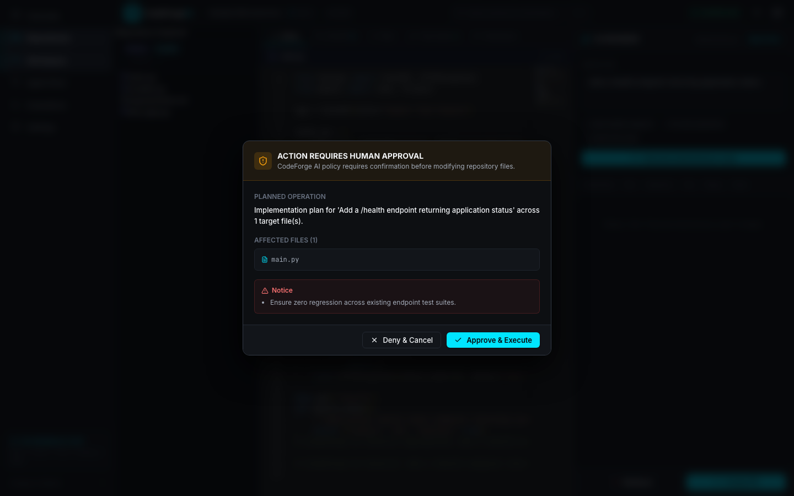

### Agent Evaluation

The evaluation dashboard provides visibility into AI engineering task outcomes and execution performance.

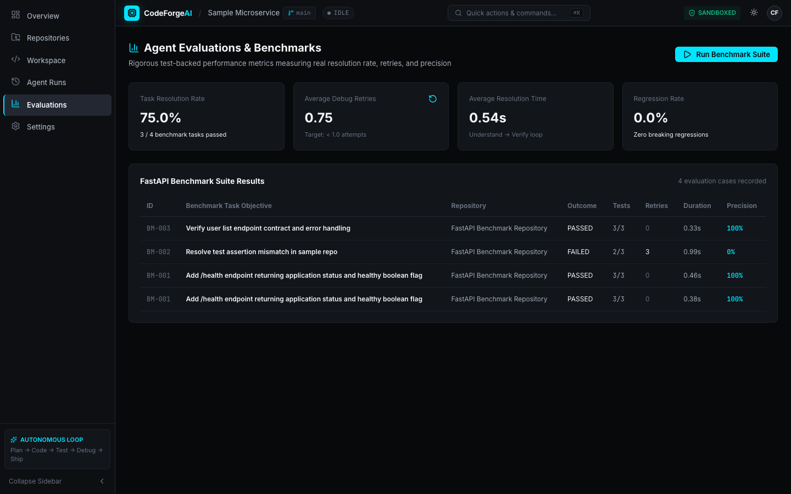

---

# ✨ Core Features

## 1. 🧠 Repository Understanding

CodeForge AI analyzes the repository before attempting implementation.

The repository intelligence layer can identify:

* files
* classes
* functions
* decorators
* imports
* calls
* HTTP routes
* related files
* test files
* architectural entry points

This gives agents more useful context than simply searching filenames.

---

# 2. 🔎 Hybrid Context Retrieval

The retriever combines multiple signals:

```text
Repository
    │
    ├── Lexical Search
    │
    ├── Symbol Graph
    │
    ├── Architectural Entry Points
    │
    └── Test File Detection
             │
             ▼
      Relevant Context
             │
             ▼
       Secret Redaction
             │
             ▼
          AI Model
```

The system can use repository relationships to find relevant implementation and testing context.

---

# 3. 📋 Structured Planning Agent

Before modifying code, the planning layer can produce a structured implementation plan containing:

* files to inspect
* candidate modification targets
* dependencies
* implementation steps
* verification commands
* risk notes

This separates **reasoning about the change** from **performing the change**.

---

# 4. ⚡ AI Code Generation

CodeForge AI supports multiple AI providers through a unified provider abstraction.

Current provider architecture includes:

```text
                 LLM Provider
                      │
        ┌─────────────┼─────────────┐
        ▼             ▼             ▼
     Gemini         OpenAI      AST Fallback
```

Model roles can be configured independently:

```text
PLANNER_MODEL
CODER_MODEL
DEBUGGER_MODEL
FAST_MODEL
```

---

# 5. 🩹 Surgical Patch Engine

Instead of blindly rewriting entire files, CodeForge AI uses a patch-oriented workflow.

```text
AI Generated Patch
       │
       ▼
Patch Validation
       │
       ├── Syntax Check
       ├── File Boundary Check
       ├── Protected File Check
       └── Patch Structure Check
       │
       ▼
Patch Application
       │
       ▼
Verification
```

If a patch fails validation, the system can roll the workspace back.

---

# 6. 🐛 Autonomous Debugging

When tests fail, the debugging agent receives:

* exit code
* command
* stdout
* stderr
* traceback
* failure information

The debugging workflow is:

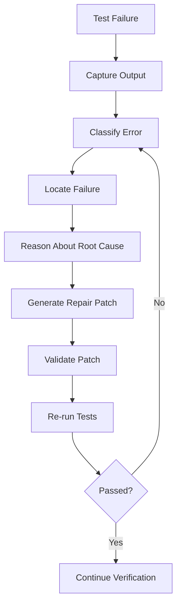

Supported error classifications include categories such as:

* test failure
* syntax error
* import error
* type error

---

# 7. 🧪 Automated Testing

CodeForge AI can discover and execute project tests and capture:

* command
* exit code
* stdout
* stderr
* duration
* pass/fail status

The current implementation includes an automated backend test suite covering:

* authentication
* security
* patch validation
* repository intelligence
* agent operations
* orchestrator approval
* evaluation benchmarking

Reported result:

```text
17 passed in 1.73 seconds
```

---

# 8. 👀 Real-Time Agent Telemetry

Long-running AI workflows should not feel like a black box.

CodeForge AI uses **Server-Sent Events (SSE)** to stream execution telemetry to the frontend.

The UI can represent stages such as:

```text
QUEUED
   ↓
UNDERSTANDING
   ↓
PLANNING
   ↓
AWAITING APPROVAL
   ↓
IMPLEMENTING
   ↓
TESTING
   ↓
ANALYZING
   ↓
FIXING
   ↓
VERIFYING
   ↓
COMPLETED
```

---

# 9. 👤 Human-in-the-Loop Approval

Autonomy should remain controllable.

CodeForge AI supports a server-side approval state:

```text
AWAITING_APPROVAL
```

The backend can pause an agent task before sensitive execution.

Approval endpoints include:

```text
POST /api/tasks/{id}/approve
POST /api/tasks/{id}/reject
POST /api/tasks/{id}/cancel
```

This allows developers to choose between controlled and more autonomous execution.

---

# 10. 🔐 AI Security

CodeForge AI includes multiple security layers around autonomous code execution.

### Secret Detection

The security layer detects credentials such as:

* API keys
* GitHub tokens
* AWS access keys
* JWTs
* private keys
* database connection strings

Detected secrets can be replaced with:

```text
[REDACTED_SECRET]
```

### Credential Protection

Sensitive files are protected from autonomous overwrites:

```text
.env
.env.*
credentials.json
id_rsa
```

### Prompt Injection Defense

Repository files are treated as untrusted data.

Conceptually:

```text
<UNTRUSTED_REPOSITORY_FILE>
    repository content
</UNTRUSTED_REPOSITORY_FILE>
```

This helps separate repository content from agent instructions.

### Tool Permissions

Tools are classified into risk categories:

```text
READ_ONLY
SAFE_WRITE
EXECUTION
GIT
```

Tool executions are recorded in the database for auditability.

---

# 11. 🔑 Authentication

CodeForge AI includes application authentication using:

* PBKDF2 password hashing
* cryptographically secure session tokens
* protected API endpoints
* login/logout workflow
* authenticated frontend sessions

Authentication endpoints include:

```text
POST /api/auth/register
POST /api/auth/login
GET  /api/auth/me
POST /api/auth/logout
```

---

# 12. 🌿 Git Integration

Each engineering task can work on an isolated task branch.

Branch pattern:

```text
agent/task-{task_id}
```

After successful verification, CodeForge AI can prepare Git operations including:

```text
Create branch
     ↓
Modify files
     ↓
Run tests
     ↓
Review diff
     ↓
Verify
     ↓
Commit
     ↓
Prepare Pull Request
```

---

# 13. 🔎 Automated Code Review

The Code Review Agent analyzes generated diffs for issues such as:

* correctness problems
* security vulnerabilities
* wildcard imports
* style regressions
* suspicious changes

This creates an additional verification layer before shipping.

---

# 14. 📊 AI Evaluation Engine

CodeForge AI includes a benchmark execution system for testing the engineering loop against sample repositories.

Current benchmark cases include:

```text
BM-001
Health endpoint implementation & verification

BM-002
Test assertion mismatch repair

BM-003
Endpoint contract verification
```

The evaluation system tracks metrics including:

* pass/fail
* retries
* duration
* test summary
* precision
* benchmark reports

Reported benchmark results:

```text
BM-001  PASS
BM-002  PASS
BM-003  PASS

Resolution Rate: 100%
Regression Rate: 0.0%
```

> These results refer to the project's reported sample benchmark runs, not a general claim about software-engineering performance across arbitrary repositories.

---

# 🔄 AI Engineering Loop

The central concept behind CodeForge AI is the closed engineering loop.

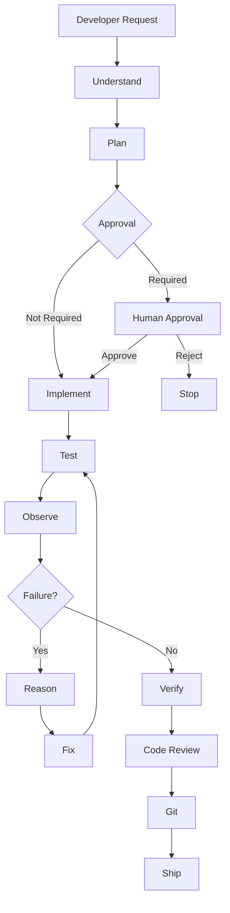

The system therefore behaves more like an engineering workflow than a single-turn coding assistant.

---

# 🤖 Multi-Agent Architecture

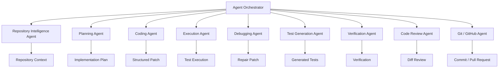

---

# 🏗️ System Architecture

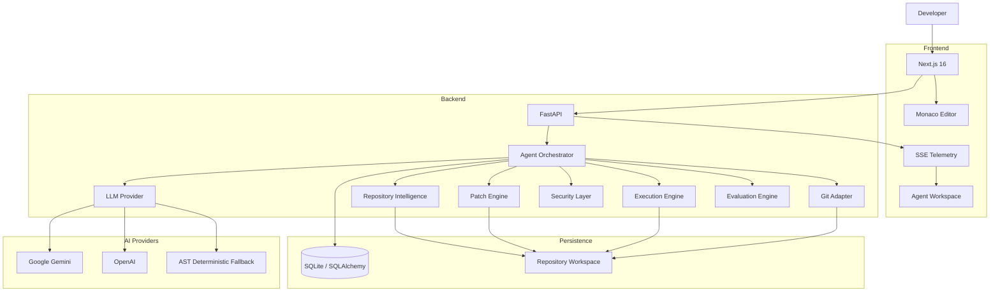

---

# 🧰 Technology Stack

| Layer           | Technology               | Purpose                       |
| --------------- | ------------------------ | ----------------------------- |
| Frontend        | Next.js 16               | Developer workspace           |
| UI              | React / TypeScript       | Application interface         |
| Editor          | Monaco Editor            | Code editing                  |
| Backend         | FastAPI                  | API and orchestration         |
| Language        | Python                   | AI/agent backend              |
| AI              | Google Gemini            | Generative AI                 |
| AI              | OpenAI                   | Alternative model provider    |
| AI Routing      | Custom Model Router      | Role-specific model selection |
| Parsing         | Python AST / code parser | Code intelligence             |
| Database        | SQLite                   | Local persistence             |
| ORM             | SQLAlchemy               | Database access               |
| Validation      | Pydantic                 | Structured schemas            |
| Streaming       | Server-Sent Events       | Live agent telemetry          |
| Testing         | Pytest                   | Automated testing             |
| Version Control | Git                      | Branching and commits         |
| GitHub          | Pull Request generation  | Engineering workflow          |
| Frontend Build  | Next.js / Turbopack      | Production builds             |

---

# 📁 Project Structure

```text
CodeForge AI/
│
├── frontend/
│   └── src/
│       └── app/
│           ├── login/
│           ├── signup/
│           └── app/
│               ├── agents/
│               ├── evaluations/
│               ├── repositories/
│               │   └── [id]/
│               └── settings/
│
├── backend/
│   ├── app/
│   │   ├── agents/
│   │   │   ├── planner_agent.py
│   │   │   ├── coding_agent.py
│   │   │   ├── debugging_agent.py
│   │   │   ├── review_agent.py
│   │   │   ├── test_agent.py
│   │   │   └── orchestrator.py
│   │   │
│   │   ├── api/
│   │   │   ├── routes_auth.py
│   │   │   ├── routes_tasks.py
│   │   │   ├── routes_evaluations.py
│   │   │   └── routes_system.py
│   │   │
│   │   ├── intelligence/
│   │   │   ├── code_parser.py
│   │   │   ├── repository_graph.py
│   │   │   └── retriever.py
│   │   │
│   │   ├── security/
│   │   │   ├── secret_guard.py
│   │   │   └── prompt_defense.py
│   │   │
│   │   ├── tools/
│   │   │   ├── patch_engine.py
│   │   │   ├── registry.py
│   │   │   └── git_adapter.py
│   │   │
│   │   ├── evaluations/
│   │   │   └── engine.py
│   │   │
│   │   ├── auth/
│   │   │   └── security.py
│   │   │
│   │   ├── models/
│   │   │   └── database.py
│   │   │
│   │   ├── services/
│   │   │   └── llm_provider.py
│   │   │
│   │   └── main.py
│   │
│   ├── tests/
│   │   ├── test_auth.py
│   │   ├── test_security.py
│   │   ├── test_patch_engine.py
│   │   ├── test_intelligence.py
│   │   ├── test_agents.py
│   │   ├── test_orchestrator.py
│   │   └── test_evaluations.py
│   │
│   └── sample_repo/
│
├── docs/
│   └── screenshots/
│
├── run_backend.sh
└── README.md
```

---

# 🔌 API Overview

## Authentication

```text
POST /api/auth/register
POST /api/auth/login
GET  /api/auth/me
POST /api/auth/logout
```

## Agent Tasks

```text
POST /api/tasks/{id}/approve
POST /api/tasks/{id}/reject
POST /api/tasks/{id}/cancel
POST /api/tasks/{id}/pr
POST /api/tasks/{id}/review

GET /api/tasks/{id}/tool_calls
GET /api/tasks/{id}/tests
```

## Evaluation

```text
GET  /api/evaluations
POST /api/evaluations/run
GET  /api/evaluations/summary
```

## System

```text
GET /api/system/status
GET /api/system/providers
GET /api/system/sandbox
GET /api/system/tools
```

---

# 🗄️ Database

CodeForge AI uses SQLite with SQLAlchemy for local persistence.

Important entities include:

```text
users
sessions
tool_calls
evaluations
test_runs
```

### `users`

Stores application user information and authentication state.

### `sessions`

Stores active authentication sessions.

### `tool_calls`

Records agent tool execution including:

* task
* agent
* tool
* arguments
* output
* errors
* exit code
* duration
* risk level

### `evaluations`

Stores benchmark execution results and metrics.

### `test_runs`

Stores test commands and execution results.

---

# 🔐 Environment Variables

Create the required backend environment configuration without committing secrets.

Example:

```env
AI_PROVIDER=gemini

GEMINI_API_KEY=
OPENAI_API_KEY=

PLANNER_MODEL=gemini-2.5-flash
CODER_MODEL=gemini-2.5-flash
DEBUGGER_MODEL=gemini-2.5-flash
FAST_MODEL=gemini-2.5-flash

MAX_AGENT_ITERATIONS=5
MAX_DEBUG_ATTEMPTS=3

COMMAND_TIMEOUT_SECONDS=60

JWT_SECRET=<GENERATE_A_SECURE_SECRET>
JWT_ALGORITHM=HS256
ACCESS_TOKEN_EXPIRE_MINUTES=1440

SANDBOX_ENABLED=true
SANDBOX_NETWORK_POLICY=NONE

MAX_CPU_PERCENT=80
MAX_MEMORY_MB=512
```

> **Never commit API keys, session secrets, private keys, or production credentials to Git.**

---

# 🚀 Getting Started

## Prerequisites

Install:

* Python 3.x
* Node.js
* npm
* Git

Optional:

* Gemini API key
* OpenAI API key
* Docker, depending on the execution environment

---

## 1. Clone the Repository

```bash
git clone <GITHUB_REPOSITORY_URL>
cd "CodeForge AI"
```

---

## 2. Start the Backend

```bash
./run_backend.sh
```

The FastAPI backend runs at:

```text
http://localhost:8000
```

API documentation:

```text
http://localhost:8000/docs
```

---

## 3. Start the Frontend

```bash
cd frontend
npm install
npm run dev
```

The Next.js application runs at:

```text
http://localhost:3000
```

---

# 🧪 Testing

Run the backend test suite:

```bash
PYTHONPATH=backend backend/venv/bin/pytest backend/tests/ -v
```

Run TypeScript checks:

```bash
cd frontend
npx tsc --noEmit
```

Run the production build:

```bash
cd frontend
npm run build
```

---

# ✅ Test Coverage

The implementation report records the following test areas:

| Test Suite             | Coverage                                             |
| ---------------------- | ---------------------------------------------------- |
| `test_auth.py`         | Authentication workflow                              |
| `test_security.py`     | Path traversal, secrets, credentials, prompt defense |
| `test_patch_engine.py` | Patch validation and rollback                        |
| `test_intelligence.py` | Symbol parsing and repository graph                  |
| `test_agents.py`       | Planner, coder, review agents                        |
| `test_orchestrator.py` | Approval and cancellation                            |
| `test_evaluations.py`  | Benchmark execution                                  |

Reported result:

```text
17 passed in 1.73 seconds
```

---

# 🎬 Demo Workflow

The recommended demonstration showcases the complete AI engineering loop.

### Step 1 — Open the Repository

Navigate to the active repository workspace.

```text
/app/repositories/active
```

### Step 2 — Select Approval Mode

Choose:

```text
Ask First
```

This demonstrates human-in-the-loop governance.

### Step 3 — Give CodeForge AI a Task

Example:

```text
Add a /health endpoint returning application status
and a healthy boolean flag.
```

### Step 4 — Understand

CodeForge AI analyzes:

* repository structure
* files
* symbols
* relevant context
* tests

### Step 5 — Plan

The Planning Agent generates an implementation plan.

### Step 6 — Approval

The system enters:

```text
AWAITING_APPROVAL
```

The developer can approve or reject the action.

### Step 7 — Implement

The Coding Agent generates and applies a structured patch.

### Step 8 — Test

The Execution Agent runs the relevant tests.

### Step 9 — Debug

If the tests fail:

```text
Failure
   ↓
Traceback Analysis
   ↓
Root Cause
   ↓
Repair Patch
   ↓
Validation
   ↓
Re-Test
```

### Step 10 — Review

The Code Review Agent analyzes the resulting diff.

### Step 11 — Verify

The system checks:

* test results
* Git state
* modified files
* diff statistics

### Step 12 — Ship

CodeForge AI can create the task branch, commit verified changes, and prepare a pull request.

---

# 🧩 Example Engineering Task

### User

```text
Add a /health endpoint to my FastAPI application.
It should return the application status and a healthy boolean.
Also add tests for the endpoint.
```

### CodeForge AI

```text
1. Understand repository
2. Find FastAPI application entrypoint
3. Find existing routes
4. Find test structure
5. Create implementation plan
6. Request approval
7. Generate patch
8. Validate patch
9. Generate/update tests
10. Run pytest
11. Analyze failures if any
12. Repair automatically
13. Re-run tests
14. Review diff
15. Verify repository state
16. Prepare Git commit / PR
```

This is the core product philosophy:

> **Don't just generate code. Complete the engineering task.**

---

# 🛡️ Security Architecture

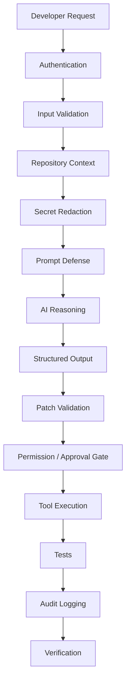

Security boundaries are designed around:

* authentication
* protected files
* path traversal prevention
* command sanitization
* secret scanning
* secret redaction
* prompt injection defense
* tool permissions
* approval gates
* execution auditing

---

# 📈 Evaluation Philosophy

A software-engineering agent should be evaluated through **actual engineering tasks**, not only conversational quality.

CodeForge AI therefore includes an evaluation engine capable of running benchmark tasks against sample repositories.

Future evaluation dimensions include:

```text
Task Resolution
       │
       ├── Tests Passed
       ├── Regression Rate
       ├── Retry Count
       ├── Execution Time
       ├── Patch Precision
       └── Token / Model Cost
```

The long-term goal is to evaluate CodeForge AI against increasingly realistic repository tasks.

---

# ⚠️ Current Limitations

The project currently has several planned areas for further expansion:

### Multi-Language Intelligence

Tree-sitter-based parsing can extend repository intelligence across additional languages such as:

* Rust
* Go
* Java
* C++
* additional JavaScript/TypeScript ecosystems

### Semantic Code Search

Future versions can add vector-based retrieval using systems such as:

```text
Chroma
FAISS
```

### GitHub Automation

A future GitHub App architecture could support:

```text
GitHub Issue
      ↓
CodeForge AI
      ↓
Repository Analysis
      ↓
Implementation
      ↓
Tests
      ↓
Verification
      ↓
Pull Request
```

---

# 🗺️ Roadmap

## Phase 1 — Core Engineering

* [x] Repository analysis
* [x] Structured planning
* [x] AI code generation
* [x] Patch validation
* [x] Automated testing
* [x] Debugging loop
* [x] Verification
* [x] Git integration

## Phase 2 — Intelligence

* [x] Cross-file symbol graph
* [x] Hybrid context retrieval
* [x] Test-aware context
* [ ] Tree-sitter multi-language support
* [ ] Semantic vector retrieval
* [ ] Dependency graph visualization

## Phase 3 — Autonomous Engineering

* [x] Approval gates
* [x] Tool permission system
* [x] Secret protection
* [x] Prompt-injection defense
* [x] Automated code review
* [x] Evaluation engine
* [ ] GitHub App integration
* [ ] Autonomous issue resolution

## Phase 4 — Engineering Platform

* [ ] Repository knowledge graph
* [ ] Long-term repository memory
* [ ] Advanced SWE benchmark suite
* [ ] Team workspaces
* [ ] Cloud execution infrastructure
* [ ] Advanced observability
* [ ] Multi-repository projects

---

# 💡 Product Vision

CodeForge AI is built around a simple idea:

> **AI should not stop when it generates code.**

A capable AI software engineer should be able to:

```text
Understand
    ↓
Plan
    ↓
Implement
    ↓
Test
    ↓
Observe
    ↓
Reason
    ↓
Fix
    ↓
Verify
    ↓
Ship
```

The long-term vision is a software-engineering agent that can take a real GitHub issue, understand a large repository, make safe changes, validate them through tests, recover from failures, and produce a reviewable pull request.

---

# 🏆 Hackathon Highlights

CodeForge AI demonstrates several engineering concepts in one platform:

### 🤖 Agentic AI

Multiple specialized agents cooperate through an orchestrator.

### 🧠 Code Intelligence

Repository graphs and hybrid retrieval provide structured code context.

### 🛠️ Full-Stack Engineering

A Next.js developer interface communicates with a FastAPI AI backend.

### 🧪 Autonomous Verification

Generated changes are tested and can enter a debugging loop.

### 🔐 AI Security

Secrets, credentials, prompt injection, tool permissions, and approval gates are treated as first-class engineering concerns.

### 📊 Measurable AI

Benchmark execution and evaluation metrics make agent performance observable.

### 🌿 Developer Workflow

Git branches, commits, diffs, reviews, and pull-request generation connect the AI loop to real software development.

---

# 📸 Recommended Screenshot Checklist

Before the hackathon submission, capture these real application screenshots:

```text
docs/
└── screenshots/
    ├── workspace.png
    ├── agent-workflow.png
    ├── repository-intelligence.png
    ├── implementation-plan.png
    ├── code-diff.png
    ├── test-execution.png
    ├── debugging.png
    ├── approval-gate.png
    ├── evaluations.png
    └── agent-history.png
```

### Recommended capture order

1. Main workspace
2. Repository tree + editor
3. AI execution timeline
4. Generated implementation plan
5. Approval modal
6. Code diff
7. Test execution
8. Debugging/retry loop
9. Evaluation dashboard
10. Git/PR workflow

These screenshots should show **real states from the running application**, not mockups.

---

# 🤝 Contributing

Contributions are welcome.

```bash
git checkout -b feature/your-feature
```

Make your changes, test them, and submit a pull request.

Before submitting:

```bash
PYTHONPATH=backend backend/venv/bin/pytest backend/tests/ -v
```

Also verify:

```bash
cd frontend
npx tsc --noEmit
npm run build
```

---

# 🐛 Bug Reports

When reporting a bug, include:

* operating system
* Python version
* Node.js version
* browser
* reproduction steps
* expected behavior
* actual behavior
* relevant agent logs
* test output
* screenshots when applicable

**Never include API keys, passwords, private keys, or other secrets.**

---

# 📄 License

See the repository license file for the applicable license and usage terms.

---


# 👥 Team

<div align="center">

| Team Member           | Role                                                    |
| --------------------- | ------------------------------------------------------- |
| **Shreyash Bhosale**  | AI/ML Engineering · Full-Stack Development · Agentic AI |
| **Sparsh Shrivastav** | AI/ML Engineering · Backend & Agent Systems             |
| **Vatsal Pithwa**     | AI/ML Engineering · Frontend & Product Development      |

</div>

### Team

**Shreyash Bhosale**
AI/ML Engineering · Full-Stack Development · Agentic AI

**Sparsh Shrivastav**
AI/ML Engineering · Backend & Agent Systems

**Vatsal Pithwa**
AI/ML Engineering · Frontend & Product Development


<br>

<a href="<GITHUB_PROFILE_URL>">
  
</a>

</div>

---

<div align="center">

### ⚒️ CodeForge AI

**Understand. Build. Test. Debug. Ship.**

*An AI software engineer for real repositories.*

</div>
